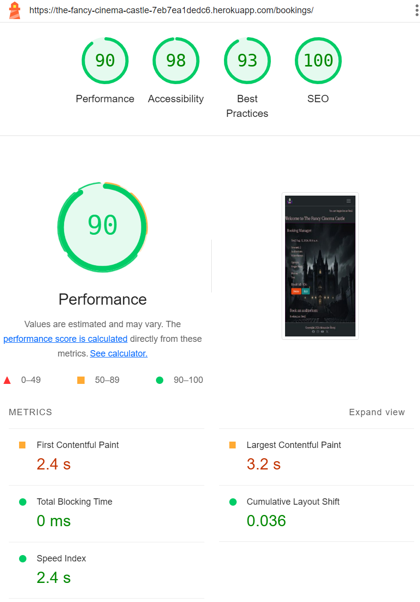
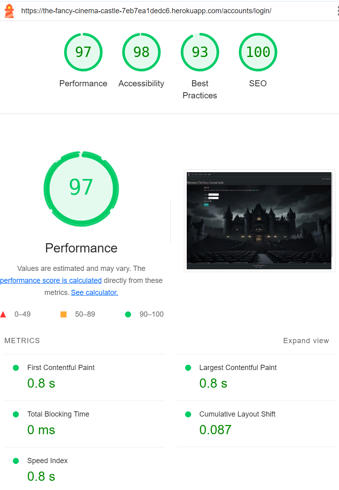

### Validator Testing 

- HTML
  -  [W3C validator](https://validator.w3.org/nu/?).
- CSS
  -  2 issues and 1 warning [(Jigsaw) validator](https://jigsaw.w3.org/css-validator/validator?) 
- JS
  - No errors was returned for JS, but 41 warnings, in the same style about ES6 [(Jigsaw) validator](https://jshint.com/).

### Quality Score through Google Devtools Lighthouse

- Lighthouse testing on Chrome Incognito to prevent cookies and background cache to slow down.
- Bookings is checked when both a bookings is made and the booking form is still there.

