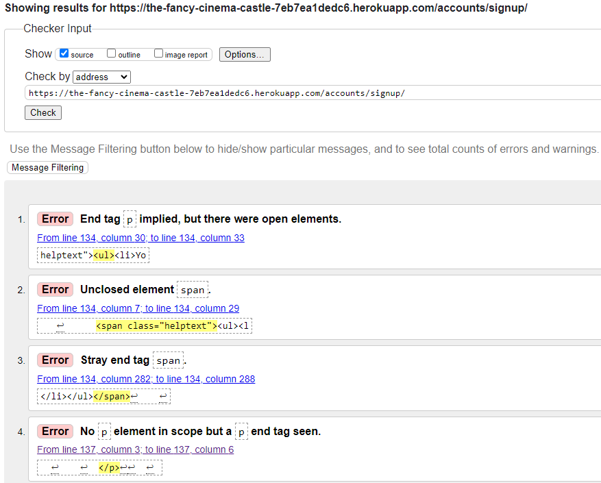
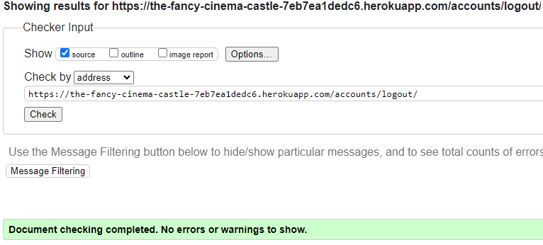

### Validator Testing 

- HTML
 - Official validator [W3C validator](https://validator.w3.org/nu/?showsource=yes&doc=https%3A%2F%2Falexanderaberg.github.io%2FDifferent-Coloured-Tea%2Findex.html) was used for all HTML validation.
  -  No errors were returned.

 -  No errors were returned.

 -  No errors were returned.

  -  4 errors were returned related to Django code, so it's not related to my code.

-  No errors were returned.

-  No errors were returned.

  
- CSS
  -  No problems, 3 warnings related to fonts and browsers [(Jigsaw) validator](https://jigsaw.w3.org/css-validator/)

- JS
  - No errors was returned for JS, but 41 warnings, in the same style about ES6, also warning for undefined variable bootstrap and three unused variables on first 3 rows, 
  but if I try change or remove and of the mentioned variables my bookings page stops working as it is supposed to, either by not remembering information on edit or by copying bookings during edit,
   even if there is already 2 bookings [(Jigsaw) validator](https://jshint.com/).

- Python
 - Official Python Validator [PEP8 Python Validator](https://pep8ci.herokuapp.com/#)

- fancy_cinema_castle directory
  - No errors were returned, but 5 lines being too long, which you will clearly see in the image why.

 - No errors were returned, but 5 lines being too long, which you will clearly see in the image why.

### Quality Score through Google Devtools Lighthouse

- Lighthouse testing on Chrome Incognito to prevent cookies and background cache to slow down.
- Bookings is checked when both a bookings is made and the booking form is still there.

