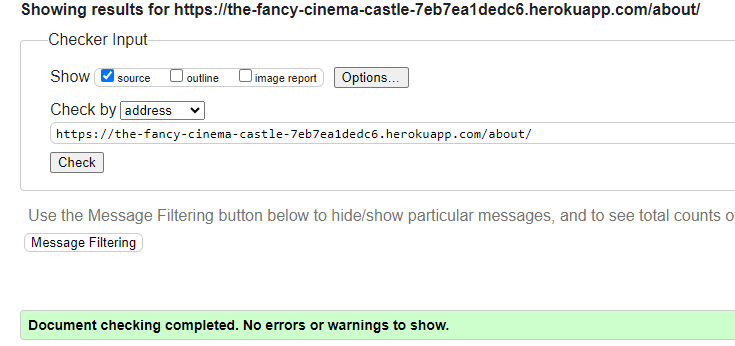
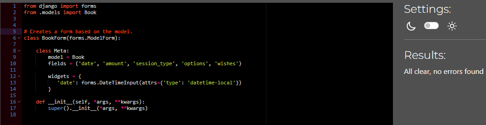
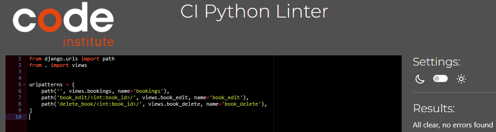

# Testing

Return back to the [README.md](README.md) file.

## Manual Test

- Fully responsive between different screen sizes and devices, tested on Samsung Apple phones, iPad and windows computer with screen sizes up to 30 inches.
- Everything seem to work according to plans and with the correct behaviour.

### Tests related to User Stories

| User Story Number | Feature | Expected Outcome | Testing Performed | Result | Comment |
|---|---|---|---|---|---|
|1|Register Account | As a Site User I can register an account so that I can book an auditorium | With help of an email I can register an account | PASS | Valid credentials |
|2|Create a booking | As a Site User I can create a booking so that I can be able to book an auditorium| Create a booking, adjust booking to my wishes and see my booking| PASS | Valid booking form and booking manager |
|3|Edit/Cancel Booking | As a Site User I can edit and cancel my booking so that I can adjust to my wants and needs | Possible to cancel and edit booking, can also see booking in Booking Manager | PASS |Valid credentials with valid info |
|4|See other bookings | As a Site Admin I can see other peoples bookings so that I can prepare the staff | In admin I can see others booking details | PASS |Valid details |
|5|Navigate | As a Site User I can navigate through with all links and buttons so that I can the full use of the site | All buttons and links works and are leading to correct places | PASS | Valid results |
|6|Booking Manager | As a Site User I can use the booking manager so that I can make a correct booking | 2 out of 3 criterias met, radio buttons and checkboxes pushed for the future| PASS with exceptions| Valid booking form with missing features|
|7|Navigation Bar | As a Site User I can use a navigation bar so that I can in an easy way find what I am looking for | Navigation bar works, have correct options, different if you are logged in or not and is responsive | PASS | Valid behaviour |
|8|Footer | As a Site User I can get info from the footer so that I can get contact information and address of the company | Social media links exist, so 1,5/3 correct, pushed rest to be decided in future | PASS with exceptiona | Valid with missing info |
|9|Home Page | As a Site User I can get information about the concepts and book so that I can get an understanding of the business | Info and links exist according to User Story | PASS | Valid Home page |
|10|About Page | As a Site User I can get more info about the specific auditorums so that I can understand what is on offer | Info and links exist according to User Story |PASS | Valid About page |
|11|Pictures | As a Site User I can see pictures so that I can see what it looks like | Relevant pictures exists and make it more attractive to the customer |PASS | Valid pictures and placements |
|12|Icons | As a Site User I can see relevant icons on the site so that I can get a better UX | Icons are relevant to the footer, navbar and favicon|PASS | Valid Icons |
|14|Deploy Project | As a Site Creator I can deploy the project so that I can make it accessible for the user |Deployed and working, no secrets found and debug is False, changed wrong info just now from True to False |PASS | Valid Deployment |
|15|Carousel on home page | As a Site User I can look at a carousel on home page so that I can see my auditorium options | Carousel is placed and working according to wishes |PASS | Valid Carousel |

### Other Tests

| Feature | Expected Outcome | Testing Performed | Result | Comment |
|---|---|---|---|---|---|
|Booking Behaviour | Maximum 2 bookings allowed with info, booking form exist only when 0 or 1 bookings |It works as expected with max 2 bookings and booking form is gone with text about max 2 bookings when 2 is booked  | PASS | Valid behaviour |
|Only book when logged in | Shouldn't be possible to book when logged out | Booking form only exists in logged in mode | PASS | Valid behaviour |
|Blank Fields | Prevent form submission with blank required fields, but allowed when not required | Can't submit form when fields is empty except for wishes | PASS | Valid behaviour |
|Warnings & Messages| Info presented when you do something wrong in bookings, messages for login, logout, registered, booked, at maximum booking, edit and delete | All messages and warnings are shown | PASS | Valid behaviour |
|You can only see your own bookings and touch them | You can only CRUD related to yourself | You only see your own bookings and therefore can't affect others, you can't book for others either | PASS | Valid behaviour |
|403 Error | Visit an url that doesn't exist gives custom 403 | Customer 403 works as expected | PASS | Validation 403 |

### Validator Testing 

- HTML
 - Official validator [W3C validator](https://validator.w3.org/nu/?showsource=yes&doc=https%3A%2F%2Falexanderaberg.github.io%2FDifferent-Coloured-Tea%2Findex.html) was used for all HTML validation.
  -  No errors were returned. 

 -  No errors were returned. 

 -  No errors were returned. 

  -  4 errors were returned related to Django code, so it's not related to my code. 

-  No errors were returned. 

-  No errors were returned. 

  
- CSS
  -  No problems, 3 warnings related to fonts and browsers [(Jigsaw) validator](https://jigsaw.w3.org/css-validator/) 

- JS
  - No errors was returned for JS, but 41 warnings, in the same style about ES6, also warning for undefined variable bootstrap and three unused variables on first 3 rows, 
  but if I try change or remove and of the mentioned variables my bookings page stops working as it is supposed to, either by not remembering information on edit or by copying bookings during edit,
   even if there is already 2 bookings [(Jigsaw) validator](https://jshint.com/). 

- Python
 - Official Python Validator [PEP8 Python Validator](https://pep8ci.herokuapp.com/#)
 - Only checked Python code from files I have worked in, not counted if one link or couple of words has been added.

- fancy_cinema_castle app
  - No errors were returned, but 5 lines being too long, which you will clearly see in the image why, was bad result with trying to break lines. 

 - No errors were returned. 

- home app
  - No errors were returned. 

 - No errors were returned. 

- about app
  - No errors were returned. 

 - No errors were returned. 

- bookings app
  - No errors were returned. 

 - No errors were returned. 

  - No errors were returned. 

 - No errors were returned. 

 - No errors were returned. 

### Quality Score through Google Devtools Lighthouse

- Lighthouse testing on Chrome Incognito to prevent cookies and background cache to slow down.
- Bookings is checked when both a bookings is made and the booking form is still there.

### Credits 

- I got inspiration on the testing structure from Jaqi: https://github.com/JaqiKal/ScrollStack/blob/main/TESTING.md 